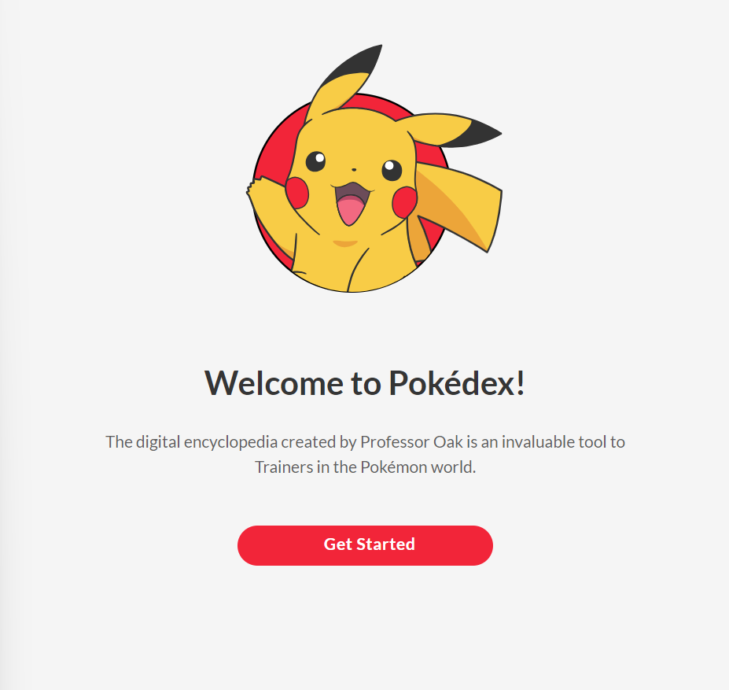
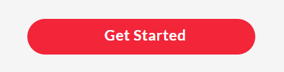
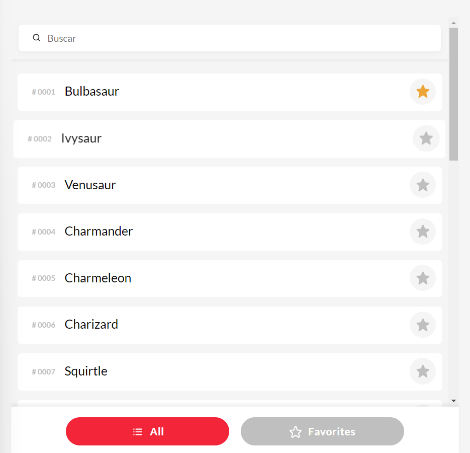
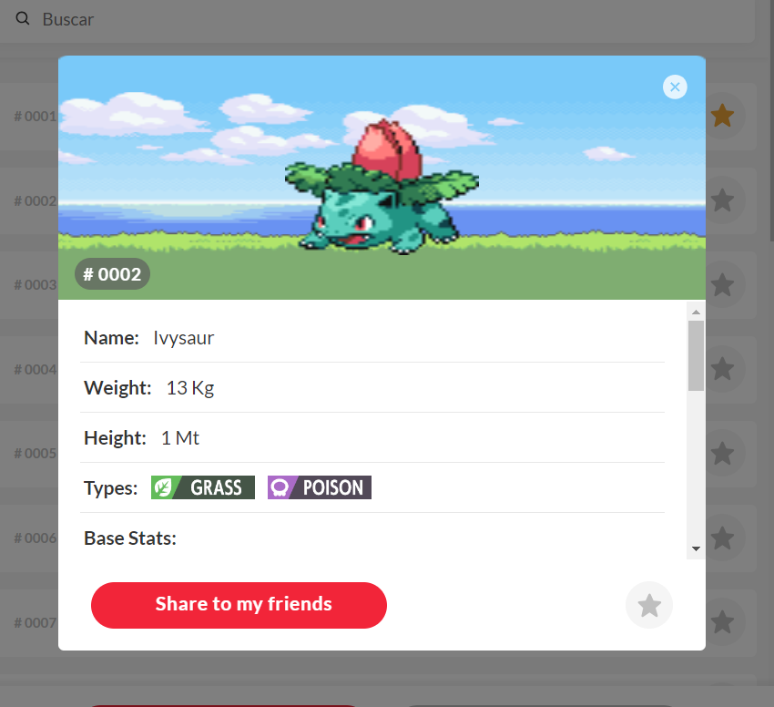
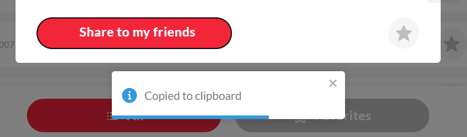
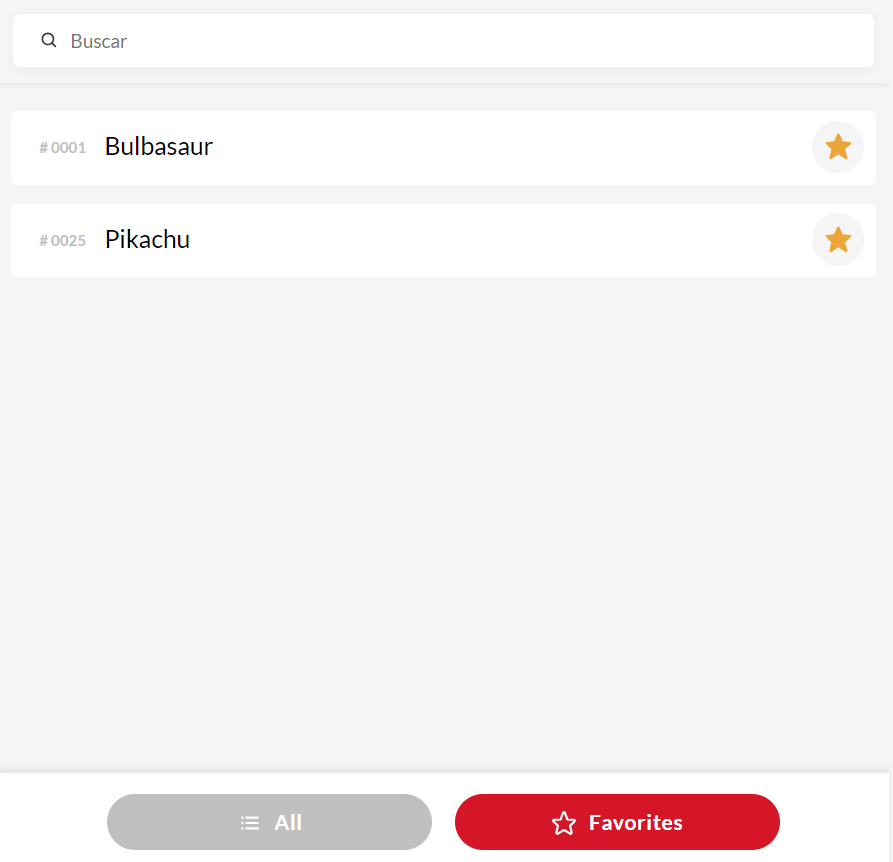
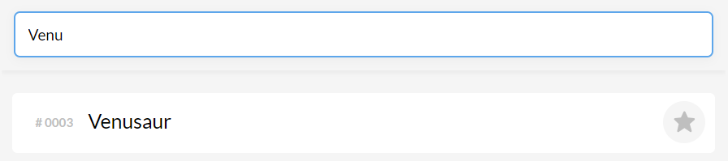

# Pokedex

# About the Project

Pokédex is a web application that serves as a detailed encyclopedia of all known Pokémon species. Each entry includes essential information such as the Pokémon’s type, abilities, evolution paths, and detailed stats.

This URL to access to this is: [Pokédex](https://pokedex-mtt.netlify.app/)

This test was created with techs:  `[Vue 3, Pinia, SFC's components ]` +  `[7-1 pattern, BEM Methodology]` +  `[Vite, Vitest]` + 

To manage the information and print the components is used the `Statefull and Stateless pattern`

To manage the PokeList is used a `Virtual Scroll` to prevents the overload of the browser at the moment of render all the Pokemon.

# How to Setup the project

### 1. Install Node:

We need to have installed NodeJs in our devices. It's recommended to have installed `@18+` version, in this case we have the `@20.9`.

Download Node in: [Download Node@20.9](https://nodejs.org/en/blog/release/v20.9.0)

### 2. Close the repositorie

With Github installed, we can clone the repositorie in our device, it's important clone these in a folder to maintain order in our machine.

`git clone https://github.com/MateoAponte/trusense-test.git`

### 3. Install dependencies

The project it's already in our device, now, we gonna install all the dependencies with the command:

`npm i`

### 5. Run the project

Vitest provides us a fastly way to run and build project. We can have the functional project in our machine with only the command:

`npm run dev`

`http://localhost:5173/`

# How use Pokédex?

### Get Started

When is the first application use, the user will be redirect to "/get-started" and can interact with the main button

This button that will be created a **Cookie** that differentiated the new user and older

### Pokédex

This will redirect to a Pokemon list, that render to the first twenty pokemon, each time that the scroll is close to the bottom of the container is going to make the request to get the next one twenty pokemon

### Pokedex Info

When a pokemon is clicked go to show a modal with all the pokemon information.

This info are:

- Name
- Weight
- Types
- Base Stats
- Passive Skills

To get all the info, a logic was develop that get the url's and before complemented that with others request to make a Object

|                                                     |                                                     |
| --------------------------------------------------- | --------------------------------------------------- |
|  |  |

Each component has a button to share the information, this will copy the link to have access to the Pokemon.

### Favorite

In the Pokedex view the user has access to your Favorites Pokemons when the **Favorites Button** is clicked.

### Filter

Is added a Input Filter to get some Pokemon by the input String

# Testing

To check that the project is working properly we can run the testing. In this project is only one way to check the testing.

### Low level test:

Running the follow command execute the unit testing to check the low level test's. That execute the testing of the helpers, api's and store.

`npm run test:unit`

# Contribution

To add any change to this project, i recommended follow the next patterns:

### 1. Git:

- Convetional Commits
- Git Trunks

### 2. Styles and HTML:

- BEM Methodology
- 7-1 Pattern

### 3. Components

- SFC'S Components
- Stateless and Statefull components
- Composition API

### 4. Testing

- Vitest to unit testing
- Any change added must pass the corresponding tests

### 5. PR's

- It's recommended that all the PR's have a card that describes the content of the PR's, all the new features, updates, fixes.
- It's recommended to have someone to review the code and accept the PR's updating
- All the updates must come from a descriptive branch, if the change goes to main it's necessary test so well, because this will be deployed directly to productive

# Author

    

  
  

# Additional notes

- The Local Storage is used to save the favorites Pokemon

- A System Cookie Management is used to know differentiate when a user is new or not, this system is useful to redirect to the Selected Pokemon By a Query Param "name"
